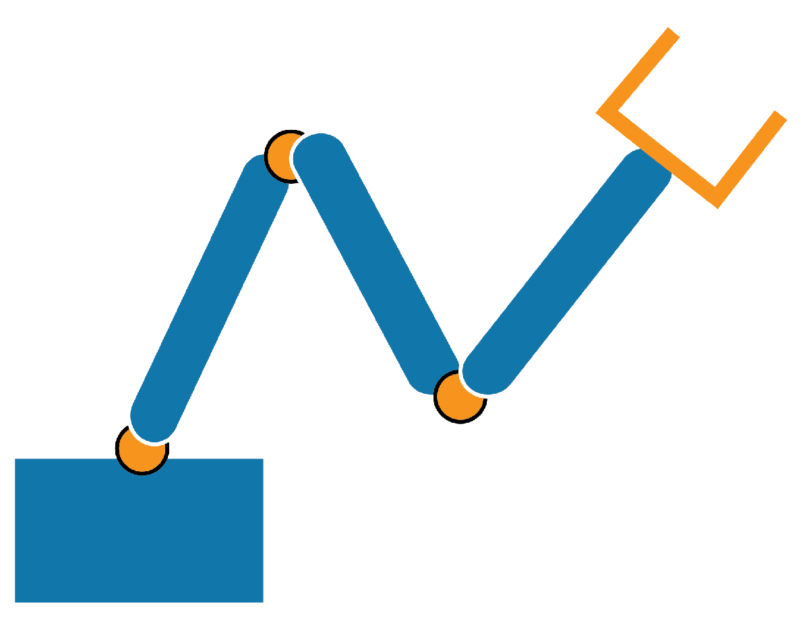

# Applied Linear Algebra

 or 

**Curriculum Module**

_Created with R2023a. Compatible with R2023a and later releases._

# Information

This curriculum module contains interactive [MATLAB® live scripts](https://www.mathworks.com/products/matlab/live-editor.html) that apply fundamental concepts and basic terminology related to linear algebra. There is a focus on identifying applications of linear algebra to academic disciplines beyond mathematics.

## Background

You can use this live script as demonstrations in lectures, class activities, or interactive assignments outside class. Applied Linear Algebra covers topics from a first course in linear algebra including vector and matrix arithmetic, solving matrix equations, null spaces, eigenvalues, and eigenvectors. Applications include balancing chemical reactions, solving static force scenarios, encryption, systems modeling, and explainable machine learning.

The instructions inside the live scripts will guide you through the exercises and activities. Get started with each live script by running it one section at a time. To stop running the script or a section midway (for example, when an animation is in progress), use the  Stop button in the **RUN** section of the **Live Editor** tab in the MATLAB Toolstrip.

## Contact Us

Solutions are available upon instructor request. Contact the [MathWorks online teaching team](mailto:onlineteaching@mathworks.com) if you would like to request solutions or have a question.

## Prerequisites

These scripts assume knowledge of basic linear algebra such as vectors, matrices, eigenvalues, and eigenvectors, as discussed in the [related courseware](#H_46A32690) on matrix methods. The focus of these scripts is on reinforcing the theoretical knowledge of linear algebra concepts by applying them in a variety of domains. There is minimal MATLAB knowledge required for these scripts, but you could use [MATLAB Onramp](https://matlabacademy.mathworks.com/details/matlab-onramp/gettingstarted) as a resource to acquire familiarity with live scripts and MATLAB syntax.

# Getting Started 
## Accessing the Module
### **On MATLAB Online:**

Use the    link to download the module. You will be prompted to log in or create a MathWorks account. The project will be loaded, and you will see an app with several navigation options to get you started.

### **On Desktop:**

Download or clone this repository. Open MATLAB, navigate to the folder containing these scripts and double-click on [AppliedLinAlg.prj](matlab: openProject("AppliedLinAlg.prj")). It will add the appropriate files to your MATLAB path and open an app that asks you where you would like to start. 

Ensure you have all the required products ([listed below](#H_E850B4FF)) installed. If you need to include a product, add it using the Add-On Explorer. To install an add-on, go to the **Home** tab and select   **Add-Ons** > **Get Add-Ons**. 

## **Working through the module:**
1.  In the opening app, select "Main Menu" to open a brief hyperlinked navigation page or "README" to open this page. To give us feedback, select "Feedback".
2. Get started with each topic by clicking the link to open the live script. The instructions inside each live script will walk you through the live script and related functions.

## Products

MATLAB® is used throughout. Tools from the Symbolic Math Toolbox™ are used frequently as well. The <samp>sevilla.jpg</samp> image in <samp>Steganography.mlx</samp> comes from the Image Processing Toolbox™. The <samp>IdentifyDigits</samp> and <samp>ReadMyWriting</samp> scripts use both the Image Processing Toolbox™, and the Statistics and Machine Learning Toolbox™. <samp>IdentifyDigits</samp> also uses the Deep Learning Toolbox™ while <samp>ReadMyWriting</samp> uses MATLAB Mobile.

# Scripts
## [BalancingChemicalEquations](./Scripts/BalancingChemicalEquations.mlx)
| Chemical reactions | **In this script, students will...** |  **Academic disciplines**  |
| :--- | :--- | :--- |
|  | <ul><li> build and solve matrix equations<li> identify the rank and null spaces of matrices<li> balance chemical reactions</ul> | <ul><li> Chemistry<li> Mathematics <ul> |

## [MarkovModeling](./Scripts/MarkovModeling.mlx)
| Zombie outbreak | **In this script, students will...** |  **Academic disciplines**  |
| :--- | :--- | :--- |
|  | <ul><li> compute powers of transition matrices <li> compute eigenvalues and eigenvectors and explain their meaning in a modeling context• create a model of a zombie outbreak <li> analyze real-world scenarios for mayflies and HIV </ul> | <ul><li> Biology <li> Mathematics </ul> |

## [Steganography](./Scripts/Steganography.mlx)
| Image encryption| **In this script, students will...** |  **Academic disciplines**  |
| :--- | :--- | :--- |
|  | <ul><li> use matrix arithmetic <li> represent images and text as matrices <li> encrypt images inside other images </ul>| <ul><li> Computer Science <li> Mathematics </ul> |

## [StaticForces](./Scripts/StaticForces.mlx) and [Moments](./Scripts/Moments.mlx)
| Static force analysis | **In this script, students will...** |  **Academic disciplines**  |
| :--- | :--- | :--- |
|  | <ul><li> define and normalize vectors <li> build and solve matrix equations <li> calculate dot products and cross products <li> solve for moments, tensions, and forces </ul> | <ul><li> Civil Engineering <li> Mechanical Engineering• Mathematics </ul> |

## [Identify Digits](./Scripts/IdentifyDigits.mlx) and [ReadMyWriting](./Scripts/ReadMyWriting.mlx)
| Machine learning | **In this script, students will...** |  **Academic disciplines**  |
| :--- | :--- | :--- |
|  | <ul><li> use Gram-Schmidt decomposition and distance <li> use binary morphology tools to preprocess image data <li> create a tool that will identify handwritten digits </ul> | <ul><li> Computer Science <li> Mathematics </ul> |

## [Robotics](./Scripts/Robotics.mlx)
| Robotic manipulators | **In this script, students will...** |  **Academic disciplines**  |
| :--- | :--- | :--- |
|  | <ul><li> compute the Cartesian result of a sum of polar vectors <li> explore the concept of a configuration space through visualizations <li> explain the connection between degrees of freedom, multiplicity of solutions, and the null space </ul> | <ul><li> Mechanical engineering <li> Mathematics </ul> |

# License

The license for this module is available in the [LICENSE.md](https://github.com/MathWorks-Teaching-Resources/Applied-Linear-Algebra/blob/release/LICENSE.md).

# Related Courseware Modules
-  [Matrix Methods of Linear Algebra](https://github.com/MathWorks-Teaching-Resources/Matrix-Methods-of-Linear-Algebra) is available on [GitHub](https://github.com/MathWorks-Teaching-Resources/Matrix-Methods-of-Linear-Algebra) or    or    
-  [Vector Arithmetic](https://github.com/MathWorks-Teaching-Resources/Vector-Arithmetic) is available on [GitHub](https://github.com/MathWorks-Teaching-Resources/Vector-Arithmetic) or    or    

Or feel free to explore our other [modular courseware content](https://www.mathworks.com/matlabcentral/fileexchange/?q=tag%3A%22courseware+module%22&sort=downloads_desc_30d).

# Educator Resources
-  [Educator Page](https://www.mathworks.com/academia/educators.html) 

Have any questions or feedback? Contact the [MathWorks teaching resources team.](mailto:onlineteaching@mathworks.com)

*&copy; Copyright 2023 The MathWorks, Inc.*

